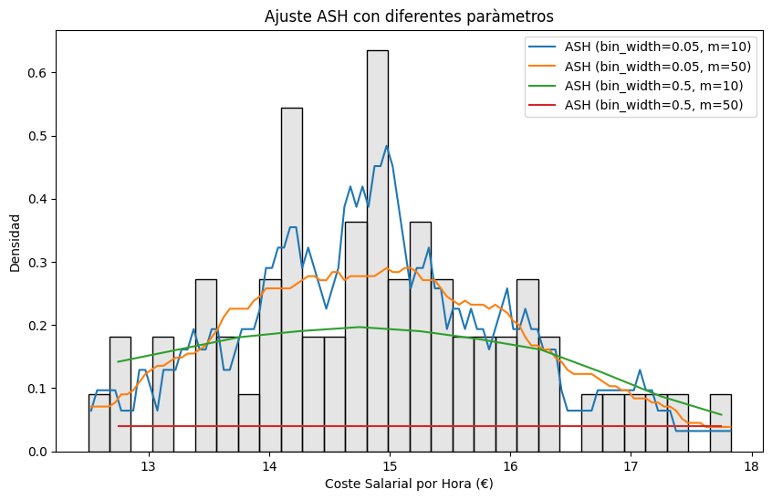

# Análisis y modelado avanzados
Estimación de funciones de densidad de probabilidad y modelo gráfico probabilístico (decision tree) para datos económicos.

# 1. Estimador ASH Avanzado para el Análisis del Coste Salarial

## Introducción
Este programa de Python se desarrolló para aplicar y visualizar una técnica avanzada de estimación de la densidad de probabilidad conocida como Histograma Promedio Desplazado (Average Shifted Histogram, ASH). El objetivo es analizar la distribución del coste salarial por hora efectiva a partir de datos proporcionados en formato CSV.

## Teoría Subyacente
La metodología ASH es una mejora del histograma tradicional que proporciona una estimación más suave de la densidad de probabilidad. Consiste en promediar múltiples histogramas desplazados para obtener una función de densidad estimada.

### Método ASH
El algoritmo ASH implementado sigue los siguientes pasos, basándose en la teoría estadística proporcionada por la Universidad Europea:

1. Creación de una malla en el rango de los datos, definida por un ancho de bin `δ` y un número `m` de desplazamientos.
2. Conteo de observaciones en cada bin para crear histogramas superpuestos.
3. Cálculo de un vector de pesos y aplicación a los histogramas para obtener una función de densidad suavizada.
4. Normalización y centrado de la función estimadora para reflejar correctamente la densidad de los datos.

## Visualización de Resultados
El script produce una visualización gráfica que muestra la densidad estimada de los costes salariales, utilizando diferentes parámetros para el ancho de bin y el número de desplazamientos. Esto permite comparar el impacto de estos parámetros en la estimación de la densidad.

# 2. Clasificador de Sectores Económicos basado en Árbol de Decisión

## Introducción
Este repositorio contiene un script de Python diseñado para clasificar sectores económicos utilizando un modelo de Árbol de Decisión. La clasificación se realiza sobre un conjunto de datos que contienen información sobre distintos sectores, y el script ejecuta un análisis exploratorio, preprocesamiento y entrenamiento de un modelo de aprendizaje automático.

## Procesamiento de Datos
El script comienza con un análisis exploratorio para identificar y manejar valores faltantes, balance de clases y preprocesamiento necesario para preparar los datos para el modelado. Se eliminan las filas con valores faltantes y se filtran las categorías no necesarias para la clasificación. 

### Codificación de Etiquetas
Se utiliza `LabelEncoder` para transformar etiquetas categóricas en representaciones numéricas, lo cual es un paso crucial para el procesamiento de datos antes del entrenamiento del modelo.

## Modelado y Evaluación
El script implementa un Árbol de Decisión, un algoritmo de aprendizaje supervisado conocido por su capacidad para formar límites de decisión complejos y su facilidad de interpretación.

### Árbol de Decisión
El modelo se configura con una profundidad máxima y un número mínimo de muestras para dividir un nodo. Estos hiperparámetros se ajustan estratégicamente para evitar el sobreajuste.

### Métricas de Evaluación
Después de entrenar el modelo, se generan y visualizan métricas de evaluación clave, como el informe de clasificación y la matriz de confusión, que proporcionan una visión detallada del rendimiento del modelo.

### Importancia de las Características
Se calcula la importancia de las características para entender qué atributos tienen el mayor impacto en la clasificación.

## Visualización del Modelo
Se incluye una visualización de la curva de aprendizaje que muestra cómo el modelo aprende con diferentes tamaños de conjuntos de entrenamiento y su rendimiento en la validación cruzada.

### Árbol de Decisión Exportado
El modelo entrenado se exporta y visualiza como un árbol de decisión utilizando Graphviz, lo que facilita la interpretación y comprensión del proceso de decisión.
[Ver Árbol de Decisión PDF](decision_tree21.pdf)

## Requisitos
El script requiere las siguientes bibliotecas de Python:
- matplotlib
- numpy
- pandas
- seaborn
- scikit-learn
- graphviz

